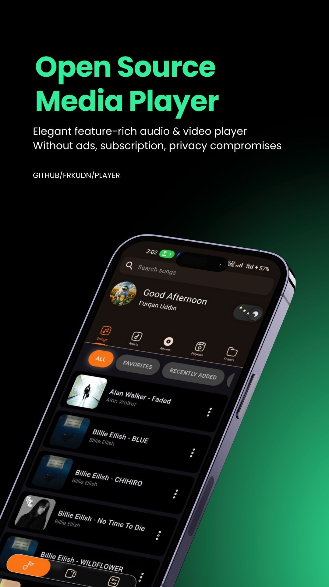
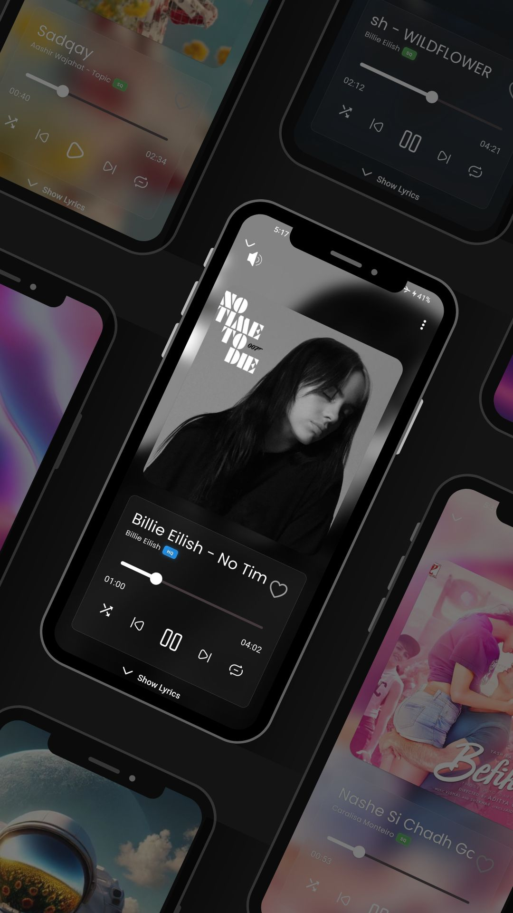
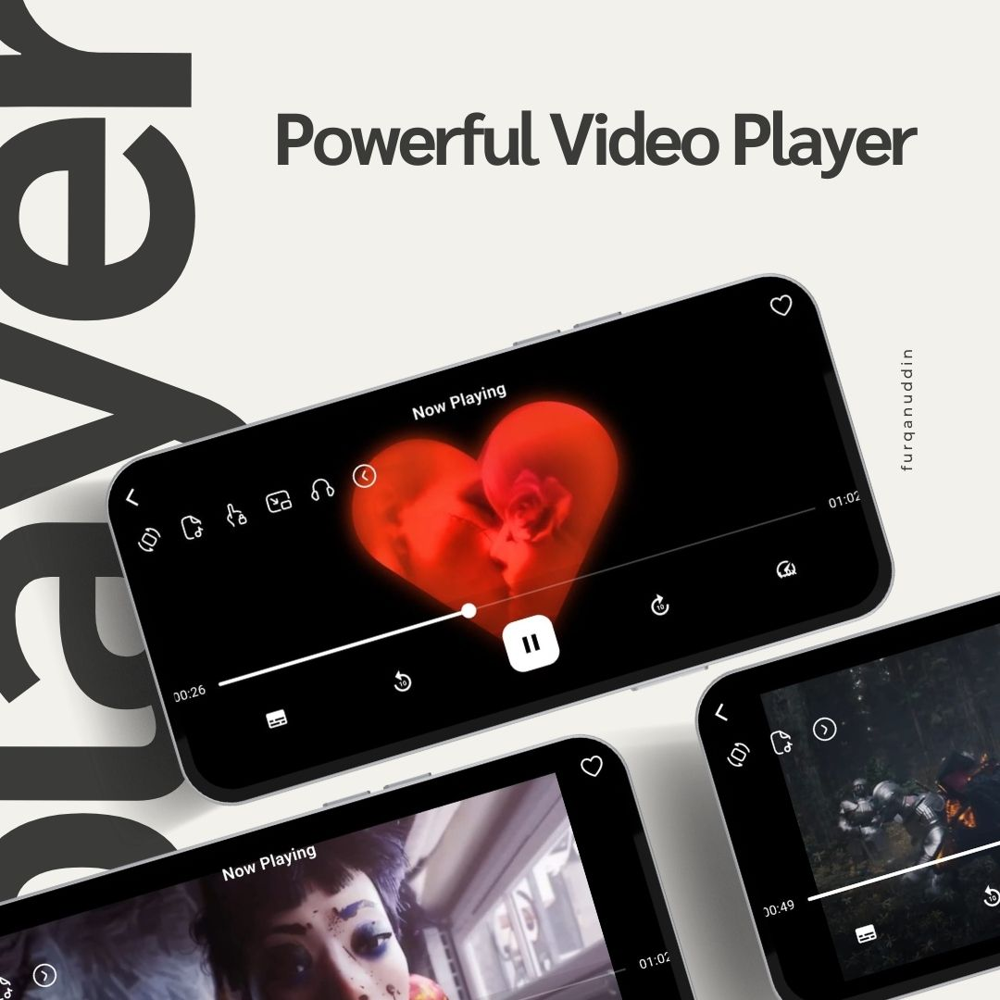

<div align="center">

<br/>


<br/><br/>

# Player

### *Elegant Multimedia. Zero Compromise.*

<p>A beautifully crafted, offline-first media player for Android — built with Flutter.<br/>No ads. No subscriptions. No data collection. Just your media, perfectly played.</p>

<br/>

[](https://frkudn.github.io/player/)
[](https://github.com/frkudn/player/releases/download/v1.0.0/player.-v1.0.1.apk)
[](https://github.com/frkudn/player/releases)

<br/>


</div>

---

<br/>

## ✦ Why Player?

> *Most media apps trade your attention for revenue — through ads, paywalls, and data harvesting. Player takes a different path.*

Player was built on a simple philosophy: **your media belongs to you**, and the experience of enjoying it should be seamless, private, and delightful. No network calls behind the scenes. No tracking. No interruptions. Just a refined, high-performance player that gets out of the way and lets your content shine.

<br/>

## ⚡ Core Highlights

|  | Feature | What it means for you |
|--|---------|----------------------|
| 🎵 | **Audio & Video Playback** | Crystal-clear playback for virtually any format |
| 🚫 | **Completely Ad-Free** | No banners, no pop-ups, no interruptions — ever |
| 🔒 | **Full Privacy** | Zero data collection, zero network access, zero compromise |
| 🎨 | **Thoughtful UI** | Clean, modern design that feels native and fast |
| ⚙️ | **Flutter-Powered** | Smooth 60fps rendering with high-performance architecture |

<br/>

## 🎛️ Feature Breakdown

<details open>
<summary><strong>🎬 Media Playback</strong></summary>
<br/>

- Full-featured **video playback** with hardware acceleration
- Rich **audio playback** with background play support
- **Local media library** with smart organization
- Broad **codec support** for all common formats
- **Subtitles & lyrics** display with sync support
- **Multi-audio track** switching mid-playback

</details>

<details open>
<summary><strong>🎨 Personalization</strong></summary>
<br/>

- **Dark & Light themes** — switch anytime
- **Customizable accent colors** to match your style
- **Multiple UI themes** for a truly personal experience
- **Multi-language support** for a global audience

</details>

<details open>
<summary><strong>🧠 Advanced Capabilities</strong></summary>
<br/>

- **Playlist creation & management** — build your perfect queue
- **Powerful media search** — find anything instantly
- **Lyrics display** synced to audio playback
- **Picture-in-Picture (PiP)** — float the player over any app
- **Playback history** — never lose your place
- **Advanced Equalizer** — tune audio to your exact taste
- **Smart media caching** for snappy load times
- **Album art & metadata** rendering with style

</details>

<br/>

## 📸 Screenshots

<div align="center">

| | | |
|--|--|--|
|  |  |  |

</div>

<br/>

## 🛠️ Installation

### Requirements

- Android **7.0 (Nougat)** or higher
- No special permissions required beyond media access

### Get Player

```
Option 1 — Direct APK
  → Download from GitHub Releases and install manually

Option 2 — Build from Source
  → Clone the repo, run `flutter pub get`, then `flutter run`
```

[](https://github.com/frkudn/player/releases/download/v1.0.0/player.-v1.0.1.apk)
[](https://github.com/frkudn/player/releases)

<br/>

## 🗺️ What's Coming Next

Player is actively growing. Here's a glimpse at what's on the horizon:

- [ ] 🚀 **Performance Optimizations** — even faster, even smoother
- [ ] 🎞️ **Additional Codec Support** — for the most obscure formats
- [ ] 🖥️ **Desktop Version** — bring Player to Windows & macOS
- [ ] 🌐 **Online Music Streaming** — your local library meets the world
- [ ] 📥 **Integrated Music Downloader** — save what you love

<br/>

## 👥 The Minds Behind Player

<div align="center">

### Core Team

<table>
  <tr>
    <td align="center" width="240">
      <a href="https://github.com/frkudn">
        
        <br/><br/>
        <strong>frkudn</strong>
      </a>
      <br/>
      <sub>🏗️ Founder & Lead Architect</sub>
      <br/>
      <sub>Flutter · Dart · UI/UX</sub>
      <br/><br/>
      <a href="https://github.com/frkudn">
        
      </a>
    </td>
    <td align="center" width="240">
      <a href="https://github.com/raj921">
        
        <br/><br/>
        <strong>raj921</strong>
      </a>
      <br/>
      <sub>🌟 First Community Contributor</sub>
      <br/>
      <sub>Hide Media Button Feature</sub>
      <br/><br/>
      <a href="https://github.com/raj921">
        
      </a>
    </td>
    <td align="center" width="240">
      <a href="#-contributing">
        
        <br/><br/>
        <strong>Your Name Here</strong>
      </a>
      <br/>
      <sub>🤝 Open Contributor Slot</sub>
      <br/>
      <sub>Be the next to shape Player</sub>
      <br/><br/>
      <a href="#-contributing">
        
      </a>
    </td>
  </tr>
</table>

</div>

<br/>

## 🤝 Contributing

Player is open source and community-driven. We welcome contributions of all kinds — from bug reports and translations to new features and design improvements.

### How to Get Started

| Step | Action | Details |
|------|--------|---------|
| 1 | **Fork** the repository | Start your own branch of Player |
| 2 | **Create** a feature branch | `git checkout -b feature/your-idea` |
| 3 | **Build** something meaningful | Write clean, well-documented code |
| 4 | **Open** a Pull Request | Describe your changes clearly |
| 5 | **Collaborate** | Engage with feedback and iterate |

### Ways to Contribute

- 🐛 **Report bugs** via [GitHub Issues](https://github.com/frkudn/player/issues)
- 💡 **Suggest features** or improvements
- 🌍 **Translate** Player into your language
- 📝 **Improve documentation**
- 🎨 **Enhance UI/UX** design
- ⚙️ **Optimize performance**

> *Every great open-source project is built one contribution at a time. Yours matters.*

<br/>

## 💬 Support & Contact

Have a question, found a bug, or just want to say hello?

- 🐛 **Issues & Bug Reports** → [GitHub Issues](https://github.com/frkudn/player/issues)
- ✉️ **Direct Contact** → [frkudn@protonmail.com](mailto:frkudn@protonmail.com)
- 🌐 **Official Website** → [frkudn.github.io/player](https://frkudn.github.io/player/)

<br/>

## 📄 License

Distributed under the **MIT License** — free to use, modify, and distribute.  
See [`LICENSE`](LICENSE) for the full terms.

<br/>

---

<div align="center">

<br/>

**Pure Media. Pure Experience.**

*Player — Your Media, Your Rules.*

<br/>

[](https://frkudn.github.io/player/)

<br/>

</div>
